# Smart Gate — архитектура (Sprint 01)

## 1. Общая схема

```mermaid
flowchart LR
    subgraph ING["Слой сигналов"]
        A["Источники: упоминания по темам<br/>(Sprint 01: синтетический корпус<br/>src/smartgate/dataset.py)"]
        A --> B["Временной ряд на тему<br/>90 дней, 1 точка = 1 день"]
    end

    subgraph STAT["Статистический слой (дёшево, O(1) на точку)"]
        B --> C{"Детектор<br/>EWMA / CUSUM / threshold"}
        C -->|"нет тревоги"| Z["Отбросить"]
        C -->|"тревога на дне i"| D["Окно решения<br/>i .. i+H (H = 7)"]
    end

    subgraph LLM["Семантический слой (дорого, только кандидаты)"]
        D --> E["Промпт: тема + контекст +<br/>ряд до дня i+H"]
        E --> F["Ollama REST /api/chat<br/>structured output (JSON schema)"]
        F --> G["Qwen3<br/>think=false, temperature=0, seed=42"]
        G --> H{"is_emerging?"}
        H -->|"сервер недоступен<br/>или ответ не парсится"| I["Детерминированный fallback<br/>llm_gate.heuristic_verdict"]
    end

    subgraph EVAL["Слой оценки"]
        H --> J["Ранжирование:<br/>score = stat_score x (1 +/- confidence)"]
        I --> J
        J --> K["Метрики: P / R / F1 / ROC-AUC / PR-AUC<br/>+ Precision@K, Recall@K, Lead Time, FPR"]
        K --> L["artifacts/*.json<br/>воспроизводимо по seed"]
    end
```

## 2. Почему именно так

| Решение | Альтернатива | Почему выбрано |
|---|---|---|
| LLM стоит **после** статистики | LLM сканирует весь поток | Стоимость токенов пропорциональна числу тревог, а не числу тем. При 200 темах модель вызывается ~120 раз, а не 200×90 раз. |
| Детекторы онлайновые (один проход) | `ruptures` (offline поиск разладки) | Offline-методам нужен весь ряд целиком; в продакшене его нет. `ruptures` остаётся в Sprint 02 как оффлайн-эталон для разметки. |
| Окно решения `H = 7` дней | Скор = максимум по всему ряду | Максимум по всему ряду — это подглядывание в будущее. Оно завышало PR-AUC с 0.55 до 0.99 (см. Report.md, DECISION-03). |
| `think=false`, `temperature=0`, `seed=42` | Дефолты Ollama | Иначе бенчмарк сравнивает режимы инференса, а не архитектуры. |
| Structured output (`format` = JSON schema) | Парсинг свободного текста | Ollama гарантирует форму ответа; парсер остаётся терпимым как вторая линия защиты. |
| Нулевые рантайм-зависимости | `numpy` / `scikit-learn` / `requests` | CI герметичен и быстр; значения метрик сверены с эталонными значениями scikit-learn в тестах. |

## 3. Границы ответственности слоёв

* **Статистический слой владеет recall.** Он обязан не пропустить тренд; ложные тревоги допустимы.
* **Семантический слой владеет precision.** Он может только отклонять кандидатов, поэтому не способен ухудшить recall — это свойство архитектуры, а не настройки.
* **Слой оценки владеет истиной.** Ни один параметр не меняется без прогона `smartgate run`.

## 4. Что здесь принципиально НЕ делается

Согласно RULE 3 и RULE 4 из брифа спринта:

* Ollama используется **только** как inference/runtime-слой. Обучения нет.
* Никакого LoRA / QLoRA / SFT / DPO / GRPO / Full FT в Sprint 01.
* Никаких shell-вызовов `ollama run` из Python — только документированный REST API.
